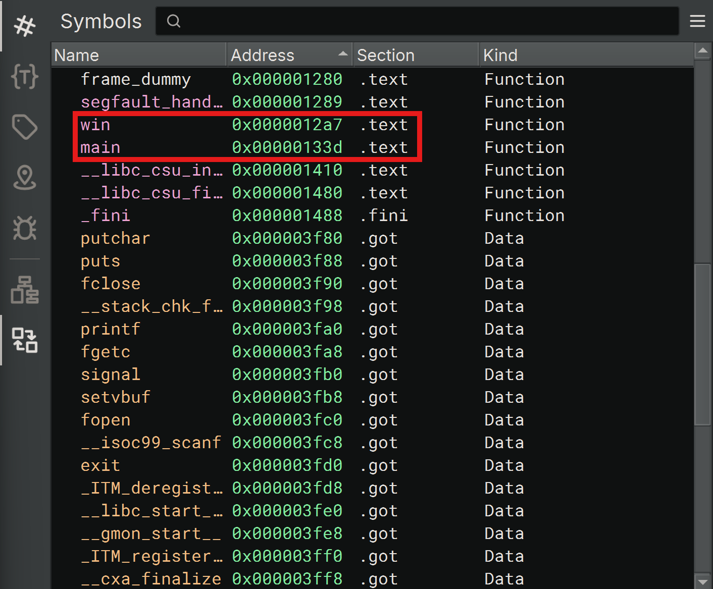

**Challenge:** PIE TIME

**Level:** Easy

**Challenge Author:** DARKRAICG492

### Description: 
Can you try to get the flag? Beware we have PIE!
Additional details will be available after launching your challenge instance.

### Step-by-Step Walkthrough:
Feel free to check out the binary and code written in C. The first thing we need to realize is what PIE is referring to.

## Learning - PIE
PIE stands for "Position Independent Executable". This basically means that if PIE is enabled, the address space of the executable when run, does not affect the execution. IE. you can expect a different memory address every time it is executed. Are we going to be looking into memory? You bet!

The second thing to realize though, is that despite the binary being loaded into a random address every time, the offsets between parts in the binary will remain the same. This is where looking at the code is useful. 

The third thing to recognize, is that there is a function in the code that we are aiming for. There is a function called "win()" that will give us the flag. Therefore, we should identify how many address spaces there are between that function, and the main function.

## Investigation - Binary Ninja
At this point, I can't suggest one tool over another, but what I used was the application "Binary Ninja" to investigate. I'm not very familiar with this tool, but I was able to stumble around to see the memory addresses



From this, we can see that the addresses we need are: 
- win: `0x0000012a7`
- main: `0x00000133d`

I can find the difference in a hex calculator online to see that I need to move ```96``` memory spaces

Now, to log in to the webshell. I get the following:

Address of main: 0x61edff0ad33d

Enter the address to jump to, ex => 0x12345:

Going back to my handy online hex calculator, I can subtract 96 from the hex value to get: ```0x61EDFF0AD2A7```

Inputting this into the webshell brings me to the expected address in memory and prints the flag!

<details><summary>Flag</summary>
    <pre>
    picoCTF{b4s1c_p051t10n_1nd3p3nd3nc3_31cc212b}
    </pre>
   </details>